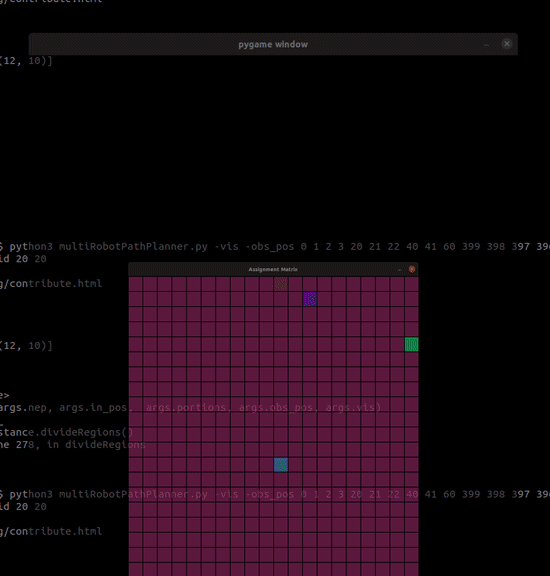
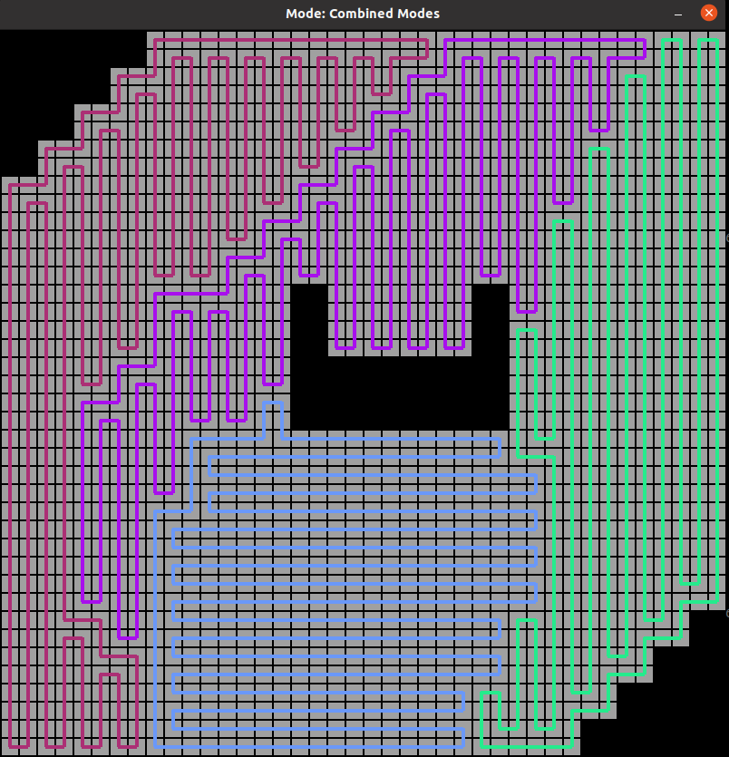

<!-- https://github.com/alice-st/DARP -->
# DARP: Divide Areas Algorithm for Optimal Multi-Robot Coverage Path Planning

After the desired area division is achieved, we use **Spanning Tree Coverage (STC) algorithm** to produce the optimal path for each robot, in order to achieve full coverage of the area of interest.

## Installation and Running

To install the application, use:
```
git clone https://github.com/hkocabas/DARP-Conda.git
cd DARP-Conda/
conda create -y --name darp python==3.9.2
conda activate darp
pip install \
	numpy==1.20\
	opencv-python==4.5.4.60 \
	pygame==2.1.0 \
	scipy==1.7.3 \
	jupyter==1.0.0 \
  numba==0.54.1\
  nose==1.3.7\
  parameterized==0.8.1\
  sklearn \
  Pillow
pip install -U scikit-learn scipy matplotlib
```

## Usage

To run the application, use:
```
python multiRobotPathPlanner.py
```

By default, without defining any parameters, the program is going to run for the following setup:

- Grid dimensions: 10 x 10
- Agent locations: 0, 3, 9
- Obstacle locations: 5, 6, 7

To define specific parameters please use the instructions below:

To visualize the results, use:
```
python multiRobotPathPlanner.py -vis
```

Grid Dimensions:
```
python multiRobotPathPlanner.py -grid x y
```

Agent locations:
```
python multiRobotPathPlanner.py -in_pos a b c
```

To use different positions for the obstacles in the Grid, use:
```
python multiRobotPathPlanner.py -obs_pos o1 o2 o3
```

Assign Different Portions:
```
python multiRobotPathPlanner.py -nep -portions p_a p_b p_c
```

<!-- where p_a p_b p_c are the portions assigned to Robots a, b and c respectively. Their sum should be equal to 1. (default: 0.2, 0.3, 0.5)

If -nep is activated (set to True), the algorithm runs for not equal territories with 20%, 30% and 50% coverage per robot. Otherwise, the algorithm runs for equal territories with 33,33% coverage per robot.  -->

Example execution
```
python multiRobotPathPlanner.py -vis -grid 5 5 -in_pos 0 24 -obs_pos 2
```

<!-- Using a 20x20 Grid area, four robots with initial positions 10, 32, 99 and 250 and equal portions of the Grid shared between the robots, we obtained the following results:
```
python multiRobotPathPlanner.py -grid 20 20 -in_pos 10 32 99 250 -obs_pos 0 1 2 3 20 21 22 40 41 60 399 398 397 396 379 378 377 359 358 339 148 153 168 173 188 189 190 191 192 193 208 209 210 211 212 213 -vis
``` -->

To run the Unittests use:
```
nosetests --nocapture mainUnitTest.py
```


<!-- ### Assignment Matrix

<p align="center">
  
</p>

### Final coverage paths for all robots

For each robot path has been utilized the mode that results in the minimum number of turns to completely cover its respective sub-region.

<p align="center">
  
</p> -->


<!-- ## Extra Material

Paper: [Zenodo](https://zenodo.org/record/2591050#.YTCvBVtRVH6)

Medium: [Medium](https://medium.com/@athanasios.kapoutsis/darp-divide-areas-algorithm-for-optimal-multi-robot-coverage-path-planning-2fed77b990a3)

GitHub repositories: [Java](https://github.com/athakapo/DARP)

GUI demo: [YouTube](https://www.youtube.com/watch?v=LrGfvma41Ak)

ROS integration: [Wiki](http://wiki.ros.org/area_division) -->
